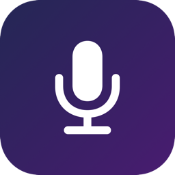

<p align="center">
  
</p>

<h1 align="center">Dictum</h1>

<p align="center"><em>"something spoken", "a uttered word" — Latin</em></p>

<p align="center">
  <a href="https://github.com/Nikoro/dictum/releases/latest"></a>
  <a href="https://github.com/Nikoro/dictum"></a>
  <!-- Keep Swift version in sync with SWIFT_VERSION in project.yml -->
  <a href="https://github.com/Nikoro/dictum"></a>
  <a href="LICENSE"></a>
</p>

Native macOS menu bar app for voice dictation. Converts speech to text and auto-pastes it into the active window. Fully on-device — no cloud, no network.

**Pipeline:** microphone → WhisperKit (CoreML, Neural Engine) → raw text → local LLM (MLX Swift) → cleaned text → auto-paste

## Requirements

| | Minimum |
|---|---|
| macOS | 26.0 (Tahoe) |
| Chip | Apple Silicon (M1+) |
| RAM | 16 GB (32 GB recommended) |
| Disk | ~5 GB for models |
| Xcode | 26.0+ (build only) |

## Stack

- **STT:** [WhisperKit](https://github.com/argmaxinc/WhisperKit) 0.17.0 — large-v3-turbo, CoreML on Neural Engine
- **LLM:** [MLX Swift LM](https://github.com/ml-explore/mlx-swift-lm) 2.29.3 — Qwen3.5 4B 4-bit (default), any mlx-community model
- **Audio:** AVAudioEngine — PCM Float32, 16kHz mono
- **Auto-paste:** CGEvent Cmd+V via Accessibility API
- **Updates:** [Sparkle](https://github.com/sparkle-project/Sparkle) 2.7+ — automatic updates from GitHub Releases

## Build

```bash
# Requires XcodeGen
brew install xcodegen

# Generate Xcode project
xcodegen generate

# Open in Xcode and build (Cmd+R)
open Dictum.xcodeproj
```

> **Note:** Must be built with Xcode (`xcodebuild`), not `swift build` — MLX Swift compiles Metal shaders.

## Permissions

On first launch, the onboarding flow guides you through:

1. **Microphone** — system prompts automatically
2. **Accessibility** — manual: System Settings → Privacy & Security → Accessibility → add Dictum

## Usage

1. Click the microphone icon in the menu bar to open the settings popover
2. Press the hotkey (default: hold `Right ⌘`) to start recording
3. Speak (language: Polish by default)
4. Release the key (hold mode) or press again (toggle mode) — press `Escape` to cancel
5. Text is automatically pasted into the active window (or copied to clipboard in context mode)

### Menu bar icon states

| Icon | State |
|------|-------|
| Template (rounded rect + mic cutout) | Idle / Warming up / Transcribing / Processing |
| Custom (mic + red dot) | Recording |

## Features

- **On-device pipeline** — WhisperKit STT + MLX LLM, no network required
- **LLM text cleanup** — optional post-processing to fix punctuation, grammar, formatting
- **Context-aware dictation** — select text before dictating to use it as LLM context; result is copied to clipboard instead of auto-pasted
- **Per-app prompts** — custom LLM prompts per application (matched by bundle ID), with `{{text}}` placeholder
- **General prompt toggle** — enable/disable the default system prompt independently
- **Model browser** — search and download models from HuggingFace (MLX community), manage downloaded models
- **Floating indicator** — translucent pill at the text cursor showing recording state and audio level
- **Configurable hotkey** — modifier-only (e.g. Right ⌘) or key+modifier combos
- **Hold / Toggle modes** — hold-to-record or press-to-start/press-to-stop
- **Onboarding** — guided setup: permissions → STT model download → optional LLM download
- **Auto-updates** — Sparkle checks GitHub Releases on launch and every 24h
- **Launch at login** — via SMAppService
- **Uninstall** — removes models, cache, settings, and moves app to Trash

## Architecture

```
┌─────────────────────────────────────────────────────────────────────┐
│  Menu Bar                                                           │
│  ┌──────────────┐  ┌──────────────────────────────────────────────┐ │
│  │ MenuBarIcon   │  │ PopoverView                                 │ │
│  │ (NSStatusItem)│  │  ┌─────────┐ ┌──────────┐ ┌─────────────┐  │ │
│  │               │  │  │ Setup   │ │ Settings │ │ Model       │  │ │
│  │  idle ○       │  │  │ View    │ │ (hotkey, │ │ Browser     │  │ │
│  │  rec  ●       │  │  │         │ │  mode,   │ │ (HF API)    │  │ │
│  │               │  │  │ perms → │ │  prompts)│ │             │  │ │
│  └──────┬───────┘  │  │ STT  → │ │          │ │  search     │  │ │
│         │          │  │ LLM    │ │          │ │  download   │  │ │
│         ▼          │  └─────────┘ └──────────┘ └─────────────┘  │ │
│    NSPopover       └──────────────────────────────────────────────┘ │
└─────────────────────────────────────────────────────────────────────┘

┌─────────────────────────────────────────────────────────────────────┐
│  Dictation Pipeline (singleton orchestrator)                        │
│                                                                     │
│  ┌──────────┐    ┌──────────┐    ┌──────────┐    ┌──────────────┐  │
│  │ Hotkey   │───▶│ Audio    │───▶│ Whisper  │───▶│ LLM         │  │
│  │ Manager  │    │ Recorder │    │ Kit STT  │    │ Processor   │  │
│  │          │    │          │    │          │    │ (optional)  │  │
│  │ CGEvent  │    │ AVAudio  │    │ CoreML / │    │ MLX Swift / │  │
│  │ tap      │    │ Engine   │    │ Neural   │    │ Metal GPU   │  │
│  │          │    │ 16kHz    │    │ Engine   │    │             │  │
│  └────┬─────┘    └──────────┘    └──────────┘    └──────┬───────┘  │
│       │                                                  │          │
│       ▼                                                  ▼          │
│  ┌──────────┐                                    ┌──────────────┐  │
│  │ Selected │                                    │ Paste        │  │
│  │ Text     │ ─ ─ context ─ ─ ─ ─ ─ ─ ─ ─ ─ ─▶│ Manager      │  │
│  │ Reader   │                                    │              │  │
│  │ (Cmd+C)  │                                    │ normal: ⌘V   │  │
│  └──────────┘                                    │ context: 📋  │  │
│                                                  └──────────────┘  │
└─────────────────────────────────────────────────────────────────────┘

┌─────────────────────────────────────────────────────────────────────┐
│  Floating Indicator                                                 │
│  ┌───────────────────────────────────────┐                          │
│  │ NSPanel (pill at cursor)              │                          │
│  │  AX API → caret position              │                          │
│  │  fallback → mouse position            │                          │
│  │  shows: state + audio level           │                          │
│  └───────────────────────────────────────┘                          │
└─────────────────────────────────────────────────────────────────────┘

┌─────────────────────────────────────────────────────────────────────┐
│  Settings & Persistence                                             │
│  ┌──────────────┐  ┌──────────────────┐  ┌───────────────────────┐ │
│  │ AppSettings  │  │ Permissions      │  │ Sparkle               │ │
│  │ (@AppStorage)│  │ Manager          │  │ (auto-updates from    │ │
│  │              │  │ (AX + Mic)       │  │  GitHub Releases)     │ │
│  └──────────────┘  └──────────────────┘  └───────────────────────┘ │
└─────────────────────────────────────────────────────────────────────┘
```

See [CLAUDE.md](CLAUDE.md) for the full layer-by-layer code reference.

## Download

Grab `Dictum.zip` from the [latest release](https://github.com/Nikoro/dictum/releases/latest). The app is ad-hoc signed (not notarized) — on first launch run:

```bash
xattr -dr com.apple.quarantine /Applications/Dictum.app
```

Or visit the [landing page](https://nikoro.github.io/dictum/) for install instructions.

## Known limitations

- First WhisperKit model run triggers CoreML compilation on ANE (~30-60s)
- Floating indicator falls back to mouse position when the app doesn't expose AX text cursor (Electron, terminals)
- ~5 GB disk space needed for models, ~5.5 GB unified memory at runtime
